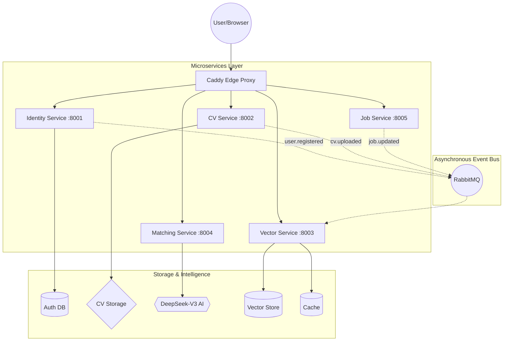

# Tumaini AI Recruitment Platform

> *"Delivering faster, fairer, and more transparent recruitment across South Africa and the African continent."*

An AI-powered recruitment platform that transforms manual CV screening into an intelligent, scalable talent acquisition engine. Built as a **Python FastAPI microservices backend** with a **React TypeScript frontend**, utilizing state-of-the-art **DeepSeek-V3** Large Language Models and **Qdrant** vector search.

---

## Table of Contents

1. [Architecture](#architecture)
2. [Tech Stack](#tech-stack)
3. [Features](#features)
4. [Project Structure](#project-structure)
5. [Prerequisites](#prerequisites)
6. [Quick Start](#quick-start)
7. [Service Reference](#service-reference)
8. [Environment Variables](#environment-variables)
9. [Development Workflow](#development-workflow)
10. [Deployment](#deployment)

---

## Architecture

The system follows an **Event-Driven Microservices Architecture** to ensure independent scalability of heavy AI workloads.



**Key Architectural Decision:** Each microservice owns its own database, ensuring loose coupling. Communication between services is primarily asynchronous via RabbitMQ domain events, maintaining system resilience.

---

## Tech Stack

| Layer | Technology | Purpose |
|---|---|---|
| **Language** | Python 3.12 | Backend services |
| **Framework** | FastAPI | Async HTTP, OpenAPI documentation |
| **Frontend** | React 19 + TypeScript + Vite | SPA with MUI v9 components |
| **Package manager** | uv (workspaces) | High-performance monorepo management |
| **Architecture** | DDD + Microservices | Domain-Driven Design isolation |
| **Message broker** | RabbitMQ 3.13 | Asynchronous domain events |
| **Vector DB** | Qdrant 1.9 | Semantic candidate search (HNSW index) |
| **AI — LLM** | **DeepSeek-V3** | Intelligent CV extraction & Match scoring |
| **Infrastructure** | **Hetzner Cloud** | South African data residency compliance |
| **Edge Server** | **Caddy** | Automated SSL (Let's Encrypt) & Reverse Proxy |

---

## Features

### AI-Driven Recruitment
- **Intelligent CV Extraction**: Replaces fragile regex with DeepSeek-V3 AI parsing. Automatically extracts names, emails, detailed work history, and complex technical skills from any PDF/DOCX.
- **RAG Matching Engine**: Uses a **Retrieval-Augmented Generation** pipeline to score candidates against job mandates. 
- **Explainable Rationales**: The AI provides natural-language evidence for every match score, increasing recruiter trust and reducing bias.
- **Semantic Talent Search**: Search for candidates using natural language (e.g., *"Senior Python dev with 5 years AWS experience in Johannesburg"*).

### Portals & Management
- **Recruiter Portal**: Full job management, automated shortlist generation, and PDF/Excel export capabilities.
- **Candidate Portal**: Profile management, CV upload tracking, and application status visibility.
- **Security**: Double-token JWT strategy (Access/Refresh) with Redis-backed revocation.
- **POPIA Compliance**: Regional deployment ensures sensitive candidate data resides within the correct legal jurisdictions.

---

## Quick Start

### 1. Clone and Configure

```bash
git clone <repo-url>
cd tumaini-platform
cp .env.example .env
```

Add your **DeepSeek API key** to `.env`:
```bash
OPENAI_API_KEY=sk-your-deepseek-key-here
```

### 2. Start Locally

```bash
docker compose up -d
```

### 3. Access the Platform

| URL | Description |
|---|---|
| `http://localhost:3009` | Production Frontend |
| `http://localhost:8001/docs` | Identity (Auth) API Docs |
| `http://localhost:8002/docs` | CV Extraction API Docs |
| `http://localhost:8005/docs` | Jobs & Shortlists API Docs |

---

## CI/CD Pipeline

The project features a fully automated **GitHub Actions** pipeline (`.github/workflows/main.yml`) that ensures code quality and handles production deployment:

1.  **Continuous Integration (CI)**:
    *   **Frontend**: Automatically builds the React application to catch compilation errors.
    *   **Backend**: Runs **Ruff** for linting and executes the full suite of **Pytest** unit tests for the shared kernel and microservices.
2.  **Continuous Deployment (CD)**:
    *   Triggered automatically ONLY when code is pushed to the `main` branch and all CI tests have passed.
    *   Connects to the Hetzner production server via SSH.
    *   Synchronizes the latest code and executes `./deploy/launch.sh` to rebuild and restart the production containers.

> **Note**: For CD to function, the following GitHub Secrets must be configured in the repository: `SERVER_IP` and `SSH_PRIVATE_KEY`.

---

## Deployment

The platform is designed for production-ready deployment on **Hetzner Cloud** using the optimized configurations in the `deploy/` directory.

### Production Environment:
- **Server**: `http://178.105.255.240`
- **Orchestration**: Docker Compose (Hardened)
- **Proxy**: Caddy (Auto-SSL)

### To Sync & Deploy Updates:
```bash
# Sync files to production (root directory)
rsync -avz --exclude '.git' --exclude 'node_modules' ./ root@178.105.255.240:/root/quantic_final_project-main/

# Rebuild and restart services on the server
ssh root@178.105.255.240 "cd /root/quantic_final_project-main && sudo ./deploy/launch.sh"
```

---

## Team & Project

Built for the **Quantic Final Project** — Master's Dissertation in Software Engineering.  
**Team:** Nexus AI  
**Institutional Leads:** Gaulotechnology

© 2026 Tumaini AI Platform. All rights reserved.
